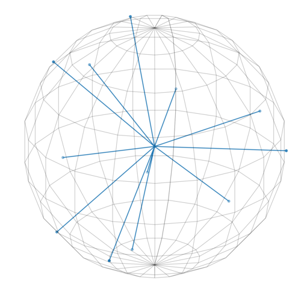

Diffusion-related meta data in GE files
=======================================

As opposed to :ref:`Siemens data <diffusion_siemens>`, there seem to be no structured private DICOM field in GE data. Even though the *Diffusion b-value* public field (0018,9087) sometimes appear at the top-level in DICOM files, this is not always the case and the direction of the diffusion gradient is neither at the top-level, nor in the standard *MR Diffusion Sequence* field.

We can however run through all tags and identify those which are coherent within volumes and may correspond to either the b-value or the direction of the diffusion gradient. Using the `diff-testing tools of Dicomifier <https://github.com/lamyj/dicomifier/blob/master/tests/diff/diff.py>`_ on two arbitrary data sets, this yields the following.

- *Diffusion b-value* (obviously)
- *(0019,10bb)*, *(0019,10bc)*, and *(0019,10bd)* within the *GEMS_ACQU_01* private creator: possible match for the direction of the diffusion gradient
- *(0043,1039)*, within the *GEMS_PARM_01* private creator: match of the *Diffusion b-value* element, when present.

The b-matrix is either missing or encoded in a binary vendor-specific field.

To validate that the three fields mentioned above are the directions of the diffusion gradient, we can plot them to check that they are distributed on the surface of a sphere.

.. code-block:: python
    
    import matplotlib.pyplot
    from mpl_toolkits.mplot3d import Axes3D
    import numpy
    import odil
    
    data_sets = [
        odil.Reader.read_file("./TEST_DIFF_GEDISCOVERY750w/a/z{}".format(
                "{:02d}".format(x) if x<100 else x
            ))[1]
        for x in range(1, 521)]
    directions = set([
        tuple(d[tag][0] for tag in ["001910bb", "001910bc", "001910bd"])
        for d in data_sets
    ])
    origin = numpy.zeros((len(directions), 3))
    
    figure = matplotlib.pyplot.figure(figsize=(8,8))
    plot = figure.add_subplot(1, 1, 1, projection="3d")
    plot.set_proj_type("ortho")
    
    plot.quiver(
        *list(zip(*origin)), *list(zip(*directions)),
        arrow_length_ratio=0, normalize=True)
    plot.scatter(*list(zip(*directions)))
    
    # draw sphere
    u, v = numpy.mgrid[0:2*numpy.pi:20j, 0:numpy.pi:10j]
    x = numpy.cos(u)*numpy.sin(v)
    y = numpy.sin(u)*numpy.sin(v)
    z = numpy.cos(v)
    plot.plot_wireframe(x, y, z, color="k", lw=0.5, alpha=0.5)
    
    plot.set_xlim(-1, 1)
    plot.set_ylim(-1, 1)
    plot.set_zlim(-1, 1)
    plot.set_axis_off()
    

    
    Directions of diffusion gradient
